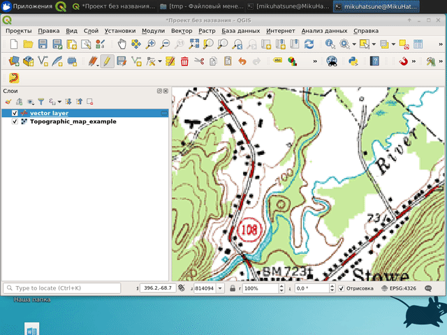

# RasterTracer

RasterTracer is a plugin for semi-automatic digitizing of an underlying raster
layer in QGis.  
It is useful, for example, when you need to digitize a scanned
topographic map, with curved black lines representing lines of equal heights of
the surface (contours). 
Instead of creating this curved vector line by manually clicking
at each segment of this curved line, with this plugin you
can click at the beginning of the curved line and at the end of the curved
line, and it will automatically trace over black pixels (or pixels that are
almost black) from the beginning to the end. 
By using this plugin you reduce
clicks while digitizing raster maps. 

The process is show here: 

## Usage

Tracing is enable only if the selected vector layer is in the editing mode.

The geometry type of the vector layer has to be MultiLineString / MultiCurve.

You can choose the color that will be traced over in the raster image. 
To do this, check the box `trace color` and select the desired color in
the dialog window.

If `trace color` is not checked, the plugin will try to trace the color that is 
similar to the color of the pixel on the map at the place where you clicked the
last time.
This means that each time you click on the map, it will trace a slightly
different color.
It slows down tracing a bit, but may be useful if the color of the line you are
tracing varies over the map.

## What image can it trace?

Right now the plugin can trace images that have a standard RGB color space. 
It has no support for any black and white, grey, or indexed images. 
This means that if your image has an unsupported colorspace, 
you have to convert the colorspace of your image to RGB first.

## Useful keys

`b` - delete last segment

`a` - switch between "trace" mode and "straight-line" mode.

`Esc` - cancel tracing segment. Useful when raster_tracer struggles to find 
a good path between clicked points (Usually when points are far from each other).
